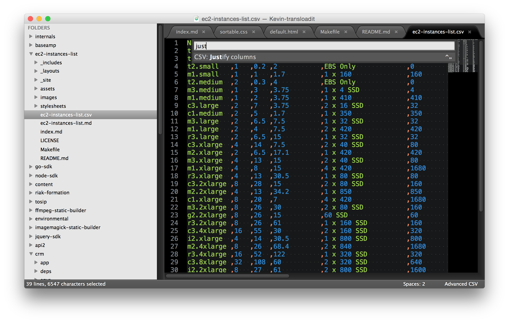





## Notes

 - Pricing based on Hosting on Linux in North Virginia (eu-west-1)
 - Spot Pricing fluctuates heavily and so should be seen as an indication at most for now
 - Since used micro type ECUs are variable, we set 0.1, 0.2, 0.3, to still allow somewhat sensible sorting. Welcoming better ideas here.

Networking speed is a megabit estimation based on Amazon's rather vague "low to moderate" properties. We will need to refine this later, but for now we're settling for:

 - "very low": `10`
 - "low": `50`
 - "low to moderate": `75`
 - "moderate": `100`
 - "high": `1000`
 - "10 gigabit": `10000`

## Todo

 1. [ ] Get love by someone who knows how to front-end (css, theme, better sorter)
 1. [ ] List completeness
 1. [ ] Automatically update pricing
 1. [ ] More accurate network speed estimations
 1. [ ] Use Travis to update the site automatically (as Github Pages won't do the csv->md translation)
 1. [ ] Add Reserved Instance prices
 1. [ ] Add a separate list for EBS volumes?
 1. [x] Investigate if we can automatically update this [We can, partly](http://stackoverflow.com/questions/7334035/get-ec2-pricing-programmatically)

## Contributing

All changes to the data should be done in `./ec2-instances-list.csv`. At the expense of some extra typing, we prefer a denormalized CSV so it's easy to distribute without formulas/logic

If you have improvements you can [directly hack on the CSV file](https://github.com/transloadit/ec2-instances-list/edit/gh-pages/ec2-instances-list.csv)

If you prefer hacking locally in SublimeText, the [Advanced CSV](https://github.com/wadetb/Sublime-Text-Advanced-CSV) plugin can be used for sorting and tidying things up (disable Word Wrap).

If you want to work on the site, `./index.md` re-uses `./README.md` as homepage intro, then includes the generated `./ec2-instances-list.md` as our main table. Overriding CSS can be done in `./assets/app.css`.

Site updates go live immediately push thanks to GitHub pages. Data updates still need a `make deploy` for the `csv`->`md` conversion.

### Contributors so far

 - [Kevin van Zonneveld](https://github.com/kvz)

